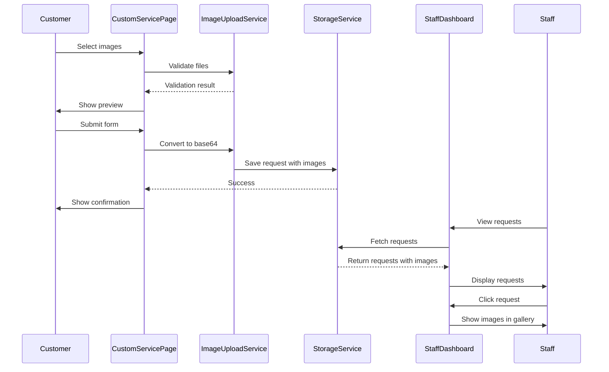

# Design Document: Custom Service Image Upload

## Overview

This feature enables customers to upload reference images when submitting custom keyboard requests and allows staff members to view, download, and manage these images through the Staff Dashboard. The implementation will use a client-side approach with base64 encoding for image storage in localStorage, providing a simple solution that works without a backend server.

The system will extend the existing Custom Service page and Staff Dashboard with image upload, preview, storage, and retrieval capabilities.

## Architecture

### High-Level Architecture

```
┌─────────────────────────────────────────────────────────────┐
│                     Frontend Application                     │
├─────────────────────────────────────────────────────────────┤
│                                                               │
│  ┌──────────────────┐         ┌──────────────────┐          │
│  │  Custom Service  │         │ Staff Dashboard  │          │
│  │      Page        │         │                  │          │
│  └────────┬─────────┘         └────────┬─────────┘          │
│           │                            │                     │
│           │                            │                     │
│  ┌────────▼────────────────────────────▼─────────┐          │
│  │      Image Upload Service Layer               │          │
│  │  - Upload Handler                             │          │
│  │  - Image Validation                           │          │
│  │  - Base64 Conversion                          │          │
│  │  - Preview Generation                         │          │
│  └────────┬──────────────────────────────────────┘          │
│           │                                                  │
│  ┌────────▼──────────────────────────────────────┐          │
│  │      Custom Request Storage Service           │          │
│  │  - LocalStorage Management                    │          │
│  │  - Request CRUD Operations                    │          │
│  │  - Image Association                          │          │
│  └───────────────────────────────────────────────┘          │
│                                                               │
└─────────────────────────────────────────────────────────────┘
```

### Component Interaction Flow



## Components and Interfaces

### 1. Image Upload Service

**Location:** `src/app/services/imageUpload.ts`

**Responsibilities:**
- Validate image files (type, size, quantity)
- Convert images to base64 format
- Generate preview URLs
- Handle upload errors

**Interface:**
```typescript
interface ImageFile {
  id: string;
  name: string;
  size: number;
  type: string;
  base64: string;
  preview: string;
  uploadedAt: string;
}

interface ValidationResult {
  valid: boolean;
  errors: string[];
}

interface ImageUploadService {
  validateFiles(files: File[]): ValidationResult;
  convertToBase64(file: File): Promise<string>;
  processImages(files: File[]): Promise<ImageFile[]>;
  generatePreview(base64: string): string;
}
```

### 2. Custom Request Storage Service

**Location:** `src/app/services/customRequestStorage.ts`

**Responsibilities:**
- Store custom requests in localStorage
- Retrieve requests with associated images
- Update request status
- Delete requests and associated images

**Interface:**
```typescript
interface CustomRequest {
  id: string;
  customerName: string;
  email: string;
  phone: string;
  layout: string;
  profile: string;
  theme: string;
  budget: string;
  description: string;
  images: ImageFile[];
  status: 'Pending' | 'In Progress' | 'Completed' | 'Cancelled';
  createdAt: string;
  updatedAt: string;
}

interface CustomRequestStorage {
  saveRequest(request: Omit<CustomRequest, 'id' | 'createdAt' | 'updatedAt'>): string;
  getRequest(id: string): CustomRequest | null;
  getAllRequests(): CustomRequest[];
  updateRequestStatus(id: string, status: CustomRequest['status']): void;
  deleteRequest(id: string): void;
}
```

### 3. Image Preview Component

**Location:** `src/app/components/ImagePreview.tsx`

**Responsibilities:**
- Display image thumbnails
- Show remove button for each image
- Handle image removal from upload queue

**Props:**
```typescript
interface ImagePreviewProps {
  images: ImageFile[];
  onRemove: (imageId: string) => void;
  maxImages?: number;
}
```

### 4. Image Gallery Component

**Location:** `src/app/components/ImageGallery.tsx`

**Responsibilities:**
- Display images in grid layout
- Open lightbox on click
- Provide download functionality
- Show placeholder when no images

**Props:**
```typescript
interface ImageGalleryProps {
  images: ImageFile[];
  requestId: string;
  onDownload?: (imageId: string) => void;
  onDownloadAll?: () => void;
}
```

### 5. Image Lightbox Component

**Location:** `src/app/components/ImageLightbox.tsx`

**Responsibilities:**
- Display full-size image in modal
- Navigate between images
- Download current image
- Close on escape or backdrop click

**Props:**
```typescript
interface ImageLightboxProps {
  images: ImageFile[];
  currentIndex: number;
  isOpen: boolean;
  onClose: () => void;
  onDownload: (imageId: string) => void;
}
```

## Data Models

### ImageFile Model

```typescript
interface ImageFile {
  id: string;              // Unique identifier (UUID)
  name: string;            // Original filename
  size: number;            // File size in bytes
  type: string;            // MIME type (image/png, image/jpeg, etc.)
  base64: string;          // Base64 encoded image data
  preview: string;         // Data URL for preview (same as base64 with data URI prefix)
  uploadedAt: string;      // ISO timestamp
}
```

### CustomRequest Model

```typescript
interface CustomRequest {
  id: string;              // Unique identifier (UUID)
  customerName: string;    // Customer full name
  email: string;           // Customer email
  phone: string;           // Customer phone (optional)
  layout: string;          // Keyboard layout (60%, 65%, etc.)
  profile: string;         // Keycap profile (Cherry, OEM, etc.)
  theme: string;           // Color theme/style
  budget: string;          // Budget range
  description: string;     // Detailed description
  images: ImageFile[];     // Array of uploaded images
  status: 'Pending' | 'In Progress' | 'Completed' | 'Cancelled';
  createdAt: string;       // ISO timestamp
  updatedAt: string;       // ISO timestamp
}
```

### LocalStorage Schema

```typescript
// Key: 'customRequests'
// Value: JSON string of CustomRequest[]
{
  "customRequests": [
    {
      "id": "req-uuid-1",
      "customerName": "John Doe",
      "email": "john@example.com",
      // ... other fields
      "images": [
        {
          "id": "img-uuid-1",
          "name": "reference1.jpg",
          "size": 245678,
          "type": "image/jpeg",
          "base64": "data:image/jpeg;base64,/9j/4AAQSkZJRg...",
          "preview": "data:image/jpeg;base64,/9j/4AAQSkZJRg...",
          "uploadedAt": "2026-03-02T10:30:00.000Z"
        }
      ],
      "status": "Pending",
      "createdAt": "2026-03-02T10:30:00.000Z",
      "updatedAt": "2026-03-02T10:30:00.000Z"
    }
  ]
}
```


## Correctness Properties

*A property is a characteristic or behavior that should hold true across all valid executions of a system—essentially, a formal statement about what the system should do. Properties serve as the bridge between human-readable specifications and machine-verifiable correctness guarantees.*

### Property 1: Image preview display
*For any* set of valid image files selected by a customer, the system should display a preview for each image before submission.
**Validates: Requirements 1.1**

### Property 2: Complete image upload
*For any* custom request submission with selected images, all images should be successfully stored in the storage service.
**Validates: Requirements 1.2**

### Property 3: Loading state during upload
*For any* image upload operation in progress, the system should display a loading indicator.
**Validates: Requirements 1.3**

### Property 4: Image data persistence
*For any* successful image upload, the stored custom request should contain the base64 data for all uploaded images.
**Validates: Requirements 1.5**

### Property 5: File format validation
*For any* image file in PNG, JPG, JPEG, or WEBP format, the validation function should accept the file.
**Validates: Requirements 2.1**

### Property 6: Base64 conversion preserves data
*For any* valid image file, converting to base64 and back should produce an equivalent image (round-trip property).
**Validates: Requirements 2.4**

### Property 7: Image removal from queue
*For any* image in the upload queue, removing it should result in the image no longer being present in the queue.
**Validates: Requirements 2.5**

### Property 8: Request retrieval completeness
*For any* set of custom requests stored in localStorage, retrieving all requests should return every stored request including their images.
**Validates: Requirements 3.1**

### Property 9: Request detail display
*For any* custom request with images, viewing the request details should display all associated images.
**Validates: Requirements 3.2**

### Property 10: Gallery rendering
*For any* non-empty array of images, the gallery component should render thumbnail previews for each image.
**Validates: Requirements 3.3**

### Property 11: Lightbox interaction
*For any* thumbnail image in the gallery, clicking it should open the lightbox with the full-size image.
**Validates: Requirements 3.4**

### Property 12: Download button presence
*For any* image displayed in the staff dashboard, a download button should be present.
**Validates: Requirements 4.1**

### Property 13: Download functionality
*For any* image with a download button, clicking the button should trigger a download with the original filename.
**Validates: Requirements 4.2**

### Property 14: Batch download availability
*For any* custom request with multiple images, a download all option should be available.
**Validates: Requirements 4.3**

### Property 15: ZIP file completeness
*For any* set of images in a custom request, downloading all should create a ZIP file containing every image.
**Validates: Requirements 4.4**

### Property 16: Unique image identifiers
*For any* two images uploaded (even with the same filename), the system should generate different unique IDs.
**Validates: Requirements 5.1**

### Property 17: Image-request association
*For any* image uploaded with a custom request, the image should be retrievable using the request ID.
**Validates: Requirements 5.2**

### Property 18: File type security validation
*For any* non-image file, the validation function should reject the file.
**Validates: Requirements 5.3**

### Property 19: Cascade deletion
*For any* custom request with images, deleting the request should also remove all associated images from storage.
**Validates: Requirements 5.5**

### Property 20: Success message accuracy
*For any* successful upload of N images, the success message should display the count N.
**Validates: Requirements 6.1**

### Property 21: Submission confirmation includes images
*For any* custom request submitted with images, the confirmation should indicate that images were included.
**Validates: Requirements 6.2**

### Property 22: Navigation warning during upload
*For any* upload operation in progress, attempting to navigate away should trigger a warning.
**Validates: Requirements 6.5**

## Error Handling

### Client-Side Validation Errors

1. **File Type Validation**
   - Error: "Invalid file type. Only PNG, JPG, JPEG, and WEBP images are allowed."
   - Trigger: User selects non-image file
   - Action: Reject file, show error toast, allow user to select different file

2. **File Size Validation**
   - Error: "File size exceeds 5MB limit. Please choose a smaller image."
   - Trigger: User selects file > 5MB
   - Action: Reject file, show error toast with file name, allow user to select different file

3. **File Quantity Validation**
   - Error: "Maximum 5 images allowed. Please remove some images to add more."
   - Trigger: User attempts to add more than 5 images
   - Action: Reject additional files, show error toast, highlight current count

### Upload Errors

1. **Base64 Conversion Error**
   - Error: "Failed to process image: [filename]. Please try again."
   - Trigger: FileReader fails to convert image
   - Action: Show error toast, allow retry, continue with other images

2. **Storage Quota Exceeded**
   - Error: "Storage limit reached. Please remove some old requests or reduce image sizes."
   - Trigger: localStorage quota exceeded
   - Action: Show error modal, prevent submission, suggest cleanup actions

3. **All Images Failed**
   - Error: "All images failed to upload. Please check your files and try again."
   - Trigger: Every image in upload batch fails
   - Action: Show error modal, prevent form submission, allow user to fix and retry

### Retrieval Errors

1. **Request Not Found**
   - Error: "Custom request not found."
   - Trigger: Attempting to access non-existent request ID
   - Action: Show error toast, redirect to requests list

2. **Corrupted Data**
   - Error: "Unable to load request data. The data may be corrupted."
   - Trigger: JSON parse error or invalid data structure
   - Action: Show error toast, log error, skip corrupted entry

### Download Errors

1. **Download Failed**
   - Error: "Failed to download image. Please try again."
   - Trigger: Blob creation or download trigger fails
   - Action: Show error toast, provide retry button

2. **ZIP Creation Failed**
   - Error: "Failed to create ZIP file. Please try downloading images individually."
   - Trigger: ZIP library error or memory issue
   - Action: Show error toast, suggest individual downloads

### Error Recovery Strategies

1. **Graceful Degradation**
   - If image preview fails, show filename and size instead
   - If thumbnail fails to load, show placeholder icon
   - If download all fails, provide individual download buttons

2. **User Feedback**
   - All errors should be user-friendly and actionable
   - Use toast notifications for non-critical errors
   - Use modal dialogs for critical errors that block workflow
   - Include specific error details (filename, size, etc.) when relevant

3. **Logging**
   - Log all errors to console for debugging
   - Include context: operation, file details, timestamp
   - Preserve error stack traces for development

## Testing Strategy

### Unit Testing

We will use **Vitest** as the testing framework, which is already compatible with the Vite build setup.

**Unit Test Coverage:**

1. **Image Upload Service Tests**
   - Test file validation logic for each supported format
   - Test file size validation with boundary values (4.9MB, 5MB, 5.1MB)
   - Test quantity validation with boundary values (4, 5, 6 images)
   - Test base64 conversion for sample images
   - Test error handling for invalid inputs

2. **Custom Request Storage Service Tests**
   - Test saving requests with and without images
   - Test retrieving requests by ID
   - Test retrieving all requests
   - Test updating request status
   - Test deleting requests and verifying image cleanup
   - Test localStorage quota handling

3. **Component Tests**
   - Test ImagePreview component renders correct number of thumbnails
   - Test ImagePreview remove button functionality
   - Test ImageGallery component with various image counts (0, 1, 5)
   - Test ImageLightbox navigation and download buttons
   - Test CustomService form submission with images

### Property-Based Testing

We will use **fast-check** library for property-based testing in TypeScript/JavaScript.

**Installation:**
```bash
npm install --save-dev fast-check
```

**Property Test Configuration:**
- Each property test should run a minimum of 100 iterations
- Each test must be tagged with a comment referencing the design document property
- Format: `// Feature: custom-service-image-upload, Property {number}: {property_text}`

**Property Test Coverage:**

1. **Property 1: Image preview display**
   - Generate: Random arrays of valid image files (1-5 images)
   - Test: Preview component displays correct number of previews
   - Tag: `// Feature: custom-service-image-upload, Property 1: Image preview display`

2. **Property 2: Complete image upload**
   - Generate: Random custom request data with random image arrays
   - Test: All images are present in stored request
   - Tag: `// Feature: custom-service-image-upload, Property 2: Complete image upload`

3. **Property 5: File format validation**
   - Generate: Files with various extensions (.png, .jpg, .jpeg, .webp, .gif, .pdf)
   - Test: Only valid formats pass validation
   - Tag: `// Feature: custom-service-image-upload, Property 5: File format validation`

4. **Property 6: Base64 conversion preserves data**
   - Generate: Random image files
   - Test: base64 → decode → compare with original
   - Tag: `// Feature: custom-service-image-upload, Property 6: Base64 conversion preserves data`

5. **Property 7: Image removal from queue**
   - Generate: Random image arrays and random removal indices
   - Test: Removed image is not in resulting array
   - Tag: `// Feature: custom-service-image-upload, Property 7: Image removal from queue`

6. **Property 8: Request retrieval completeness**
   - Generate: Random arrays of custom requests
   - Test: All stored requests are retrieved
   - Tag: `// Feature: custom-service-image-upload, Property 8: Request retrieval completeness`

7. **Property 16: Unique image identifiers**
   - Generate: Multiple images with same filename
   - Test: All generated IDs are unique
   - Tag: `// Feature: custom-service-image-upload, Property 16: Unique image identifiers`

8. **Property 19: Cascade deletion**
   - Generate: Random custom request with images
   - Test: After deletion, no images remain in storage
   - Tag: `// Feature: custom-service-image-upload, Property 19: Cascade deletion`

### Integration Testing

1. **End-to-End Flow Tests**
   - Customer uploads images → submits form → staff views request → downloads images
   - Test with various image counts (0, 1, 5)
   - Test with various image formats
   - Test error scenarios (oversized files, invalid formats)

2. **LocalStorage Integration**
   - Test data persistence across page reloads
   - Test storage quota limits
   - Test concurrent access scenarios

### Test Execution Strategy

1. **Development Phase**
   - Run unit tests on file save
   - Run property tests before commits
   - Maintain >80% code coverage

2. **Pre-Deployment**
   - Run full test suite including integration tests
   - Verify all property tests pass with 100 iterations
   - Manual testing of UI interactions

3. **Continuous Integration**
   - Automated test runs on pull requests
   - Block merges if tests fail
   - Generate coverage reports

## Implementation Notes

### LocalStorage Limitations

1. **Storage Quota**
   - Most browsers limit localStorage to 5-10MB
   - Base64 encoding increases file size by ~33%
   - With 5MB limit, approximately 3-4MB of actual image data can be stored
   - Recommend limiting to 5 images × 5MB = 25MB theoretical, but practical limit is much lower

2. **Mitigation Strategies**
   - Implement image compression before base64 conversion
   - Warn users when approaching storage limits
   - Provide option to clear old requests
   - Consider implementing image resizing for thumbnails

### Browser Compatibility

- FileReader API: Supported in all modern browsers
- localStorage: Supported in all modern browsers
- Base64 encoding/decoding: Native support in all browsers
- Download functionality: Use `<a>` tag with download attribute

### Performance Considerations

1. **Large Image Handling**
   - Base64 conversion is synchronous and can block UI
   - Use async/await with FileReader for better UX
   - Show progress indicator during conversion

2. **Rendering Optimization**
   - Use lazy loading for image galleries
   - Implement virtual scrolling for large request lists
   - Cache base64 strings to avoid re-conversion

### Security Considerations

1. **File Type Validation**
   - Validate MIME type from File object
   - Check file extension as secondary validation
   - Reject executable files and scripts

2. **XSS Prevention**
   - Base64 data URLs are safe from XSS
   - Sanitize all user input in form fields
   - Use React's built-in XSS protection

3. **Data Privacy**
   - Images stored in localStorage are accessible to any script on the domain
   - Warn users not to upload sensitive information
   - Implement clear data deletion functionality

## Future Enhancements

1. **Backend Integration**
   - Replace localStorage with proper backend API
   - Implement cloud storage (AWS S3, Cloudinary)
   - Add image optimization pipeline

2. **Advanced Features**
   - Image editing tools (crop, rotate, filters)
   - Drag-and-drop reordering
   - Image annotations and comments
   - Automatic thumbnail generation

3. **Performance Improvements**
   - Implement progressive image loading
   - Add image caching layer
   - Use WebP format for better compression

4. **User Experience**
   - Add image zoom functionality
   - Implement image comparison view
   - Add bulk operations (select multiple, delete multiple)
